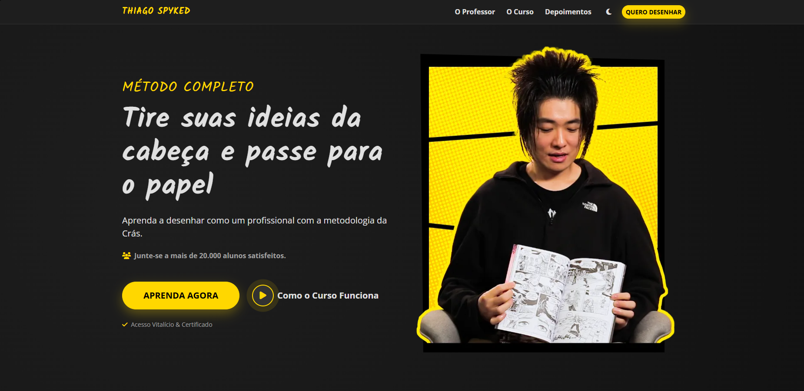

# 🎨 Redesign - Landing Page "Como Desenhar" (Estudo de Caso)

> **⚠️ AVISO LEGAL:** Este projeto é um **Estudo de Caso Acadêmico/Portfólio** desenvolvido para fins de aprendizado em Front-end.
> **Eu NÃO possuo vínculo comercial com o Thiago Spyked, a editora Kebook ou o curso "Como Desenhar".**
> 
> 👉 **Site Oficial do Curso:** [comodesenhar.net](https://comodesenhar.net)



---

## 📋 Sobre o Projeto
O objetivo deste projeto foi recriar a Landing Page de um infoproduto real, focando em melhorar a **Performance**, a **Experiência do Usuário (UX)** e a **Acessibilidade**.

O site original foi reestruturado utilizando tecnologias modernas, garantindo um carregamento instantâneo e uma navegação fluida tanto em celulares quanto em desktops.

### 🚀 Melhorias Implementadas
* **Performance Extrema:** Otimização de imagens (WebP) e carregamento de scripts sob demanda (Lazy Loading no YouTube).
* **Dark Mode / Light Mode:** Detecção automática da preferência do sistema do usuário com chave seletora manual (CSS Variables).
* **UX Aprimorada:**
    * Substituição de carrosséis pesados por grades responsivas.
    * Acordeões interativos para a grade curricular.
    * Modais leves para exibição de vídeos (sem iframes pesando a página inicial).
* **Design Responsivo:** Layout 100% adaptável (Mobile First) utilizando o Grid System do Bootstrap 5.

---

## 🛠️ Tecnologias Utilizadas

* **HTML5 Semântico:** Estrutura organizada e amigável para SEO.
* **CSS3 & Variáveis:** Para gerenciamento de temas (Claro/Escuro) e animações.
* **Bootstrap 5.3:** Framework base para grid e componentes (Modais, Acordeões).
* **JavaScript (Vanilla):** Lógica para troca de temas, manipulação de modais e expansão de conteúdo.
* **FontAwesome:** Ícones vetoriais.

---

## ⚙️ Como Rodar Localmente

1.  Clone este repositório:
    ```bash
    git clone https://github.com/GabrielSSegatto/redesign-como-desenhar
    ```
2.  Entre na pasta do projeto.
3.  Abra o arquivo `index.html` no seu navegador.

---
## ⚖️ Direitos Autorais e Créditos

Todo o conteúdo textual, imagens dos produtos e vídeos pertencem aos seus respectivos criadores:
* **Autor do Curso:** Thiago Spyked 
* **Produtora:** Crás Conversa Oficial

Este código é disponibilizado como **Open Source** para fins de estudo.

---

<div align="center">
  Desenvolvido com 💻 e ☕ por <strong>Gabriel Soares Segatto</strong>
  
  [LinkedIn](https://www.linkedin.com/jobs/) 
</div>
